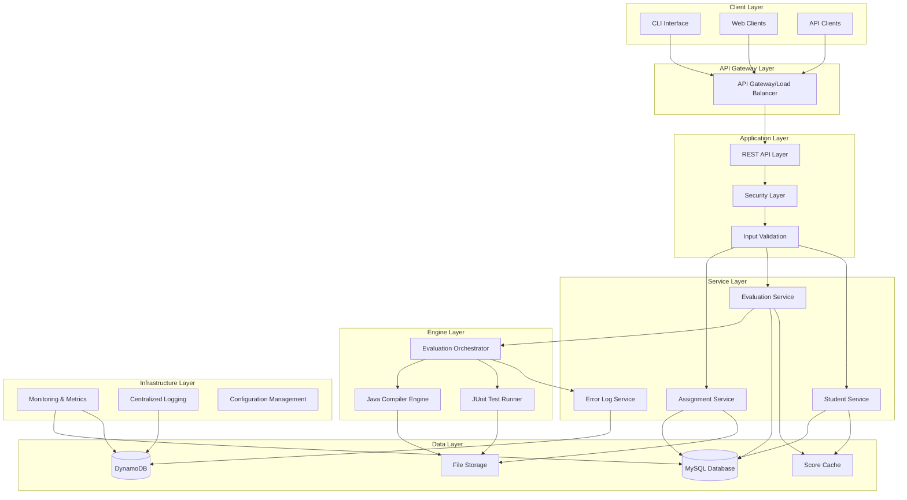
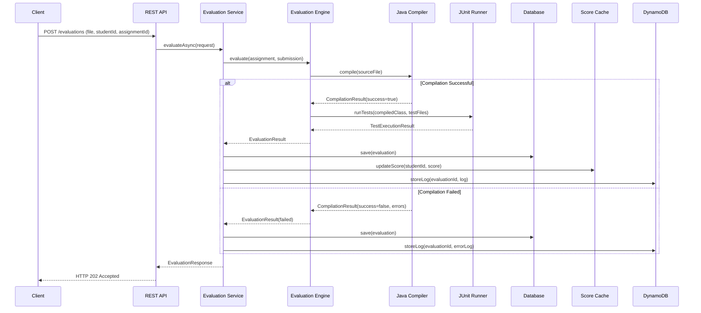
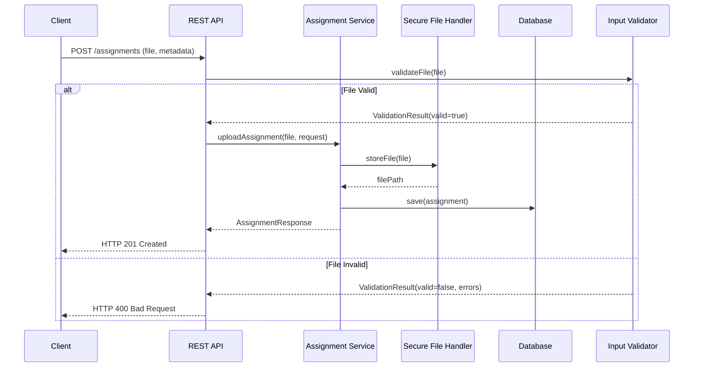

# E-Learning Platform with Auto Evaluation - Architecture Guide

## Overview

The E-Learning Platform with Auto Evaluation is designed as a modular, scalable educational technology solution that automates programming assignment evaluation and provides comprehensive learning management features. This guide provides detailed information about the system architecture, component interactions, and development practices.

## System Architecture

### High-Level Architecture



### Layered Architecture

The system follows a layered architecture pattern with clear separation of concerns:

1. **Presentation Layer**: REST API endpoints and CLI interface
2. **Service Layer**: Business logic and orchestration
3. **Engine Layer**: Core evaluation functionality
4. **Data Access Layer**: Repository pattern for data persistence
5. **Infrastructure Layer**: Cross-cutting concerns

## Core Components

### 1. REST API Layer

**Location**: `src/main/java/com/studentevaluator/controller/`

**Responsibilities**:
- HTTP request/response handling
- Input validation and sanitization
- Authentication and authorization
- Error response formatting
- API documentation (OpenAPI/Swagger)

**Key Classes**:
```java
@RestController
@RequestMapping("/api/v1")
public class EvaluationController {
    // Assignment upload endpoints
    // Evaluation trigger endpoints
    // Result retrieval endpoints
}

@RestController
@RequestMapping("/api/v1/students")
public class StudentController {
    // Student score endpoints
    // Evaluation history endpoints
}

@ControllerAdvice
public class GlobalExceptionHandler {
    // Centralized error handling
    // Error response formatting
}
```

**Design Patterns**:
- **Controller Pattern**: Separate controllers for different resource types
- **DTO Pattern**: Data Transfer Objects for API requests/responses
- **Exception Handler Pattern**: Centralized error handling

### 2. Service Layer

**Location**: `src/main/java/com/studentevaluator/service/`

**Responsibilities**:
- Business logic implementation
- Transaction management
- Service orchestration
- Data validation
- Caching coordination

**Key Services**:

```java
@Service
@Transactional
public class EvaluationService {
    private final EvaluationEngine evaluationEngine;
    private final EvaluationRepository evaluationRepository;
    private final ScoreCache scoreCache;
    
    @Async
    public CompletableFuture<EvaluationResult> evaluateAsync(EvaluationRequest request) {
        // Orchestrate evaluation process
        // Handle async processing
        // Update cache and database
    }
}

@Service
public class AssignmentService {
    private final AssignmentRepository assignmentRepository;
    private final SecureFileHandler fileHandler;
    
    public Assignment uploadAssignment(MultipartFile file, AssignmentUploadRequest request) {
        // File validation and storage
        // Assignment metadata management
    }
}

@Service
public class StudentService {
    private final StudentRepository studentRepository;
    private final ScoreCache scoreCache;
    
    public StudentScoreResponse getStudentScores(String studentId) {
        // Score aggregation
        // Cache utilization
    }
}
```

**Design Patterns**:
- **Service Layer Pattern**: Business logic encapsulation
- **Transaction Script Pattern**: Transaction boundary management
- **Async Pattern**: Non-blocking evaluation processing

### 3. Evaluation Engine

**Location**: `src/main/java/com/studentevaluator/engine/`

**Responsibilities**:
- Java code compilation
- JUnit test execution
- Result aggregation
- Security sandboxing
- Resource management

**Core Engine Components**:

```java
@Component
public class JavaCompiler {
    private final JavaCompiler systemCompiler;
    private final SecurityManager securityManager;
    
    public CompilationResult compile(File sourceFile, String outputDir) {
        // Secure compilation process
        // Error capture and reporting
        // Resource cleanup
    }
}

@Component
public class JUnitTestRunner {
    private final TestEngine testEngine;
    private final ExecutorService executorService;
    
    public TestExecutionResult runTests(File compiledClass, List<File> testFiles) {
        // Dynamic test loading
        // Timeout management
        // Result collection
    }
}

@Component
public class EvaluationEngine {
    private final JavaCompiler javaCompiler;
    private final JUnitTestRunner testRunner;
    
    public EvaluationResult evaluate(Assignment assignment, File submission) {
        // Orchestrate compilation and testing
        // Score calculation
        // Result aggregation
    }
}
```

**Design Patterns**:
- **Strategy Pattern**: Different compilation and testing strategies
- **Template Method Pattern**: Common evaluation workflow
- **Command Pattern**: Encapsulate evaluation operations

### 4. Data Access Layer

**Location**: `src/main/java/com/studentevaluator/repository/`

**Responsibilities**:
- Data persistence abstraction
- Query optimization
- Connection management
- Transaction coordination

**Repository Structure**:

```java
@Repository
public interface StudentRepository extends JpaRepository<Student, String> {
    @Query("SELECT s FROM Student s WHERE s.email = :email")
    Optional<Student> findByEmail(@Param("email") String email);
    
    @Query("SELECT s FROM Student s JOIN s.evaluations e WHERE e.assignmentId = :assignmentId")
    List<Student> findByAssignmentId(@Param("assignmentId") String assignmentId);
}

@Repository
public interface EvaluationRepository extends JpaRepository<Evaluation, String> {
    List<Evaluation> findByStudentIdAndStatus(String studentId, EvaluationStatus status);
    
    @Query("SELECT AVG(e.score) FROM Evaluation e WHERE e.assignmentId = :assignmentId")
    Double findAverageScoreByAssignment(@Param("assignmentId") String assignmentId);
}

@Repository
@Component
public class DynamoDBRepository {
    private final DynamoDbClient dynamoDbClient;
    
    public void storeEvaluationLog(String evaluationId, EvaluationLog log) {
        // Store unstructured evaluation data
    }
    
    public List<EvaluationLog> getEvaluationLogs(String evaluationId) {
        // Retrieve evaluation logs
    }
}
```

**Design Patterns**:
- **Repository Pattern**: Data access abstraction
- **Unit of Work Pattern**: Transaction management
- **Query Object Pattern**: Complex query encapsulation

### 5. Caching Layer

**Location**: `src/main/java/com/studentevaluator/service/ScoreCache.java`

**Responsibilities**:
- Fast score lookups
- Cache invalidation
- Memory management
- Thread safety

```java
@Component
public class ScoreCache {
    private final Map<Integer, Double> studentScoreMap = new ConcurrentHashMap<>();
    private final Map<String, LocalDateTime> cacheTimestamps = new ConcurrentHashMap<>();
    
    public void updateScore(String studentId, Double score) {
        int hashCode = studentId.hashCode();
        studentScoreMap.put(hashCode, score);
        cacheTimestamps.put(studentId, LocalDateTime.now());
    }
    
    public Optional<Double> getScore(String studentId) {
        int hashCode = studentId.hashCode();
        return Optional.ofNullable(studentScoreMap.get(hashCode));
    }
    
    @Scheduled(fixedRate = 300000) // 5 minutes
    public void cleanupExpiredEntries() {
        // Remove expired cache entries
    }
}
```

**Design Patterns**:
- **Cache-Aside Pattern**: Manual cache management
- **Time-based Expiration**: Automatic cache cleanup
- **Thread-Safe Singleton**: Concurrent access handling

## Component Interactions

### Evaluation Workflow



### Assignment Upload Workflow



## Data Models and Relationships

### Entity Relationship Diagram

```mermaid
erDiagram
    STUDENT {
        string student_id PK
        string name
        string email
        timestamp created_at
    }
    
    ASSIGNMENT {
        string assignment_id PK
        string title
        string description
        string test_file_path
        timestamp created_at
    }
    
    EVALUATION {
        string evaluation_id PK
        string student_id FK
        string assignment_id FK
        decimal score
        decimal max_score
        enum status
        timestamp evaluated_at
    }
    
    EVALUATION_LOG {
        string evaluation_id PK
        string timestamp SK
        string log_level
        string message
        json details
    }
    
    STUDENT ||--o{ EVALUATION : "has many"
    ASSIGNMENT ||--o{ EVALUATION : "evaluated by"
    EVALUATION ||--o{ EVALUATION_LOG : "generates"
```

### Domain Model Classes

```java
// Core Domain Entities
@Entity
@Table(name = "students")
public class Student {
    @Id
    private String studentId;
    private String name;
    private String email;
    private LocalDateTime createdAt;
    
    @OneToMany(mappedBy = "studentId", cascade = CascadeType.ALL)
    private List<Evaluation> evaluations = new ArrayList<>();
}

@Entity
@Table(name = "assignments")
public class Assignment {
    @Id
    private String assignmentId;
    private String title;
    private String description;
    private String testFilePath;
    private LocalDateTime createdAt;
    
    @OneToMany(mappedBy = "assignmentId", cascade = CascadeType.ALL)
    private List<Evaluation> evaluations = new ArrayList<>();
}

@Entity
@Table(name = "evaluations")
public class Evaluation {
    @Id
    private String evaluationId;
    private String studentId;
    private String assignmentId;
    private BigDecimal score;
    private BigDecimal maxScore;
    
    @Enumerated(EnumType.STRING)
    private EvaluationStatus status;
    
    private LocalDateTime evaluatedAt;
}

// Value Objects
public class CompilationResult {
    private final boolean successful;
    private final String output;
    private final List<String> errors;
    private final String compiledClassPath;
}

public class TestExecutionResult {
    private final int totalTests;
    private final int passedTests;
    private final int failedTests;
    private final List<TestCase> testCases;
    private final String executionLog;
}

public class EvaluationResult {
    private final String evaluationId;
    private final CompilationResult compilationResult;
    private final TestExecutionResult testResult;
    private final double finalScore;
    private final EvaluationStatus status;
}
```

## Configuration Management

### Application Configuration

**Location**: `src/main/resources/application.yml`

```yaml
# Database Configuration
spring:
  datasource:
    url: jdbc:mysql://${DB_HOST:localhost}:${DB_PORT:3306}/${DB_NAME:student_evaluator}
    username: ${DB_USERNAME:evaluator}
    password: ${DB_PASSWORD:password}
    driver-class-name: com.mysql.cj.jdbc.Driver
    
  jpa:
    hibernate:
      ddl-auto: ${DDL_AUTO:validate}
    show-sql: ${SHOW_SQL:false}
    properties:
      hibernate:
        dialect: org.hibernate.dialect.MySQL8Dialect
        format_sql: true

# AWS Configuration
aws:
  region: ${AWS_REGION:us-east-1}
  dynamodb:
    endpoint: ${DYNAMODB_ENDPOINT:}
    table-name: ${DYNAMODB_TABLE:evaluation_logs}

# Evaluation Configuration
evaluation:
  timeout: ${EVAL_TIMEOUT:30000}
  max-file-size: ${MAX_FILE_SIZE:1048576}
  temp-directory: ${TEMP_DIR:/tmp/evaluations}
  max-concurrent-evaluations: ${MAX_CONCURRENT:10}

# Security Configuration
security:
  rate-limit:
    requests-per-minute: ${RATE_LIMIT:100}
    enabled: ${RATE_LIMIT_ENABLED:true}
  file-validation:
    allowed-extensions: ${ALLOWED_EXTENSIONS:.java}
    max-file-size: ${MAX_FILE_SIZE:1048576}

# Monitoring Configuration
management:
  endpoints:
    web:
      exposure:
        include: health,metrics,info,prometheus
  endpoint:
    health:
      show-details: always
  metrics:
    export:
      prometheus:
        enabled: true

# Logging Configuration
logging:
  level:
    com.studentevaluator: ${LOG_LEVEL:INFO}
    org.springframework.security: WARN
    org.hibernate.SQL: ${SQL_LOG_LEVEL:WARN}
  pattern:
    console: "%d{yyyy-MM-dd HH:mm:ss} - %msg%n"
    file: "%d{yyyy-MM-dd HH:mm:ss} [%thread] %-5level %logger{36} - %msg%n"
  file:
    name: ${LOG_FILE:logs/student-evaluator.log}
```

### Environment-Specific Configuration

**Development** (`application-dev.yml`):
```yaml
spring:
  datasource:
    url: jdbc:h2:mem:testdb
    driver-class-name: org.h2.Driver
  jpa:
    hibernate:
      ddl-auto: create-drop
    show-sql: true

aws:
  dynamodb:
    endpoint: http://localhost:8000

logging:
  level:
    com.studentevaluator: DEBUG
```

**Production** (`application-prod.yml`):
```yaml
spring:
  datasource:
    url: jdbc:mysql://${RDS_HOSTNAME}:${RDS_PORT}/${RDS_DB_NAME}
    username: ${RDS_USERNAME}
    password: ${RDS_PASSWORD}
  jpa:
    hibernate:
      ddl-auto: validate
    show-sql: false

aws:
  region: us-east-1
  dynamodb:
    endpoint: # Use AWS DynamoDB service

security:
  rate-limit:
    requests-per-minute: 1000

logging:
  level:
    com.studentevaluator: INFO
```

## Security Architecture

### Security Layers

1. **Input Validation Layer**
   - File type validation
   - Content sanitization
   - Size restrictions
   - Path traversal prevention

2. **Rate Limiting Layer**
   - Request throttling
   - IP-based limiting
   - Endpoint-specific limits

3. **Execution Security Layer**
   - Sandboxed compilation
   - Resource limits
   - Timeout mechanisms
   - Restricted file access

### Security Components

```java
@Component
public class InputValidator {
    public ValidationResult validateJavaFile(MultipartFile file) {
        // File extension validation
        // Content type validation
        // Size validation
        // Malicious content detection
    }
}

@Component
public class SecureFileHandler {
    public String storeFile(MultipartFile file, String directory) {
        // Secure file storage
        // Path traversal prevention
        // Permission management
    }
}

@Component
public class RateLimitingFilter implements Filter {
    public void doFilter(ServletRequest request, ServletResponse response, FilterChain chain) {
        // Rate limiting logic
        // IP tracking
        // Request counting
    }
}
```

## Performance Considerations

### Caching Strategy

1. **Application-Level Caching**
   - Student score HashMap cache
   - Assignment metadata cache
   - Compilation result cache

2. **Database-Level Caching**
   - Connection pooling
   - Query result caching
   - Index optimization

3. **File System Caching**
   - Compiled class caching
   - Test file caching

### Async Processing

```java
@Configuration
@EnableAsync
public class AsyncConfig {
    @Bean
    public TaskExecutor taskExecutor() {
        ThreadPoolTaskExecutor executor = new ThreadPoolTaskExecutor();
        executor.setCorePoolSize(5);
        executor.setMaxPoolSize(20);
        executor.setQueueCapacity(100);
        executor.setThreadNamePrefix("evaluation-");
        executor.initialize();
        return executor;
    }
}

@Service
public class EvaluationService {
    @Async
    public CompletableFuture<EvaluationResult> evaluateAsync(EvaluationRequest request) {
        // Async evaluation processing
        // Non-blocking operation
        // Result callback handling
    }
}
```

### Resource Management

1. **Memory Management**
   - Heap size configuration
   - Garbage collection tuning
   - Memory leak prevention

2. **File System Management**
   - Temporary file cleanup
   - Disk space monitoring
   - File handle management

3. **Database Connection Management**
   - Connection pooling
   - Connection timeout
   - Prepared statement caching

## Monitoring and Observability

### Metrics Collection

```java
@Component
public class PerformanceMonitor {
    private final MeterRegistry meterRegistry;
    private final Counter evaluationCounter;
    private final Timer evaluationTimer;
    
    public void recordEvaluation(EvaluationResult result) {
        evaluationCounter.increment(
            Tags.of("status", result.getStatus().toString())
        );
        
        evaluationTimer.record(
            result.getExecutionTime(),
            TimeUnit.MILLISECONDS
        );
    }
}
```

### Health Checks

```java
@Component
public class EvaluationSystemHealthIndicator implements HealthIndicator {
    @Override
    public Health health() {
        // Database connectivity check
        // File system access check
        // External service availability check
        
        return Health.up()
            .withDetail("database", "UP")
            .withDetail("filesystem", "UP")
            .withDetail("cache", "UP")
            .build();
    }
}
```

### Logging Strategy

1. **Structured Logging**
   - JSON format for production
   - Correlation IDs for request tracking
   - Context-aware logging

2. **Log Levels**
   - ERROR: System errors and exceptions
   - WARN: Performance issues and warnings
   - INFO: Business events and milestones
   - DEBUG: Detailed execution flow

3. **Log Aggregation**
   - Centralized logging with ELK stack
   - Log shipping to external systems
   - Real-time log analysis

## Testing Architecture

### Testing Pyramid

1. **Unit Tests** (70%)
   - Service layer testing
   - Repository testing
   - Utility class testing

2. **Integration Tests** (20%)
   - Database integration
   - API endpoint testing
   - Component interaction testing

3. **End-to-End Tests** (10%)
   - Complete workflow testing
   - BDD scenario testing
   - Performance testing

### Test Configuration

```java
@SpringBootTest
@TestPropertySource(locations = "classpath:application-test.properties")
@Testcontainers
class IntegrationTestBase {
    @Container
    static MySQLContainer<?> mysql = new MySQLContainer<>("mysql:8.0")
            .withDatabaseName("test_db")
            .withUsername("test")
            .withPassword("test");
    
    @Container
    static GenericContainer<?> dynamodb = new GenericContainer<>("amazon/dynamodb-local:latest")
            .withExposedPorts(8000);
    
    @DynamicPropertySource
    static void configureProperties(DynamicPropertyRegistry registry) {
        registry.add("spring.datasource.url", mysql::getJdbcUrl);
        registry.add("aws.dynamodb.endpoint", 
            () -> "http://localhost:" + dynamodb.getFirstMappedPort());
    }
}
```

## Deployment Architecture

### Container Strategy

```dockerfile
# Multi-stage build
FROM maven:3.8-openjdk-11 AS build
WORKDIR /app
COPY pom.xml .
COPY src ./src
RUN mvn clean package -DskipTests

FROM openjdk:11-jre-slim
WORKDIR /app
COPY --from=build /app/target/student-evaluator-*.jar app.jar
EXPOSE 8080
ENTRYPOINT ["java", "-jar", "app.jar"]
```

### Infrastructure as Code

```yaml
# docker-compose.yml
version: '3.8'
services:
  app:
    build: .
    ports:
      - "8080:8080"
    environment:
      - DB_HOST=mysql
      - DYNAMODB_ENDPOINT=http://dynamodb:8000
    depends_on:
      - mysql
      - dynamodb
  
  mysql:
    image: mysql:8.0
    environment:
      MYSQL_DATABASE: student_evaluator
      MYSQL_USER: evaluator
      MYSQL_PASSWORD: password
      MYSQL_ROOT_PASSWORD: rootpassword
    volumes:
      - mysql_data:/var/lib/mysql
  
  dynamodb:
    image: amazon/dynamodb-local:latest
    ports:
      - "8000:8000"
    command: ["-jar", "DynamoDBLocal.jar", "-sharedDb", "-inMemory"]

volumes:
  mysql_data:
```

## Development Guidelines

### Code Organization

```
src/main/java/com/studentevaluator/
├── config/                 # Configuration classes
├── controller/             # REST controllers
├── service/               # Business logic services
├── repository/            # Data access layer
├── model/                 # Domain entities
├── dto/                   # Data transfer objects
├── engine/                # Evaluation engines
├── security/              # Security components
├── exception/             # Custom exceptions
├── cli/                   # CLI implementation
└── util/                  # Utility classes

src/main/resources/
├── application.yml        # Main configuration
├── application-dev.yml    # Development config
├── application-prod.yml   # Production config
├── db/migration/          # Database migrations
└── static/                # Static resources

src/test/java/
├── integration/           # Integration tests
├── unit/                  # Unit tests
├── bdd/                   # BDD tests
└── performance/           # Performance tests
```

### Coding Standards

1. **Naming Conventions**
   - Classes: PascalCase
   - Methods: camelCase
   - Constants: UPPER_SNAKE_CASE
   - Packages: lowercase

2. **Documentation**
   - Javadoc for public APIs
   - README files for modules
   - Architecture decision records (ADRs)

3. **Error Handling**
   - Custom exception hierarchy
   - Meaningful error messages
   - Proper logging

4. **Testing**
   - Test-driven development
   - High test coverage (>80%)
   - Integration test coverage

## Extension Points

### Plugin Architecture

The system is designed to support extensions through well-defined interfaces:

```java
public interface CompilerPlugin {
    CompilationResult compile(File sourceFile, CompilerOptions options);
    boolean supports(String fileExtension);
}

public interface TestRunnerPlugin {
    TestExecutionResult runTests(File compiledClass, List<File> testFiles);
    boolean supports(String testFramework);
}

public interface StoragePlugin {
    void store(String key, Object data);
    <T> Optional<T> retrieve(String key, Class<T> type);
}
```

### Configuration Extension

```java
@ConfigurationProperties(prefix = "evaluation.plugins")
public class PluginConfiguration {
    private List<String> enabledPlugins = new ArrayList<>();
    private Map<String, Object> pluginSettings = new HashMap<>();
}
```

This architecture provides a solid foundation for the Student Evaluator System while maintaining flexibility for future enhancements and scalability requirements.