# Student Evaluator System - Code Reference Guide

## Overview

This guide provides a functional overview of all Java components in the Student Evaluator System. Each section describes what the code does, why it's important, and how it fits into the overall system.

---

## 🏗️ System Architecture Diagram

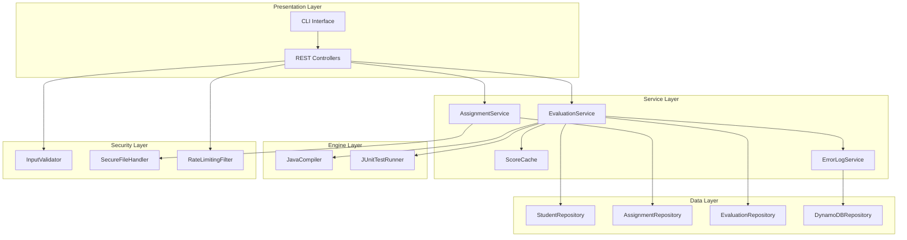

## 📊 Class Relationship Diagram

```mermaid
classDiagram
    class StudentEvaluatorApplication {
        +main(String[] args)
    }
    
    class EvaluationController {
        -EvaluationService evaluationService
        +triggerEvaluation(EvaluationRequest) ResponseEntity
        +getEvaluationStatus(String) ResponseEntity
        +getEvaluationResults(String) ResponseEntity
        +uploadAssignment(MultipartFile, AssignmentUploadRequest) ResponseEntity
        +uploadTestFiles(String, MultipartFile[]) ResponseEntity
    }
    
    class StudentController {
        -EvaluationService evaluationService
        +getStudentScores(String) ResponseEntity
        +getStudentEvaluations(String, String, String) ResponseEntity
    }
    
    class EvaluationService {
        -JavaCompiler javaCompiler
        -JUnitTestRunner testRunner
        -EvaluationRepository evaluationRepository
        -ScoreCache scoreCache
        -ErrorLogService errorLogService
        +evaluateAsync(EvaluationRequest) CompletableFuture
        +getEvaluationStatus(String) EvaluationResponse
        +getEvaluationResults(String) EvaluationResult
        +calculateScore(TestExecutionResult) double
        -saveEvaluation(Evaluation) void
        -updateCache(String, Double) void
    }
    
    class AssignmentService {
        -AssignmentRepository assignmentRepository
        -SecureFileHandler fileHandler
        -InputValidator validator
        +uploadAssignment(MultipartFile, AssignmentUploadRequest) Assignment
        +uploadTestFiles(String, MultipartFile[]) Assignment
        +getAssignment(String) Assignment
        +listAssignments(Pageable) Page~Assignment~
        -validateAssignmentFile(MultipartFile) ValidationResult
        -storeAssignmentFile(MultipartFile) String
    }
    
    class JavaCompiler {
        -SecurityManager securityManager
        +compile(File, String) CompilationResult
        +validateSyntax(File) ValidationResult
        -captureCompilationErrors(DiagnosticCollector) List~String~
        -setupSecureEnvironment() void
        -cleanupTempFiles(String) void
    }
    
    class JUnitTestRunner {
        -TestEngine testEngine
        -ExecutorService executorService
        +runTests(File, List~File~) TestExecutionResult
        +runTestsWithTimeout(File, List~File~, long) TestExecutionResult
        -loadTestClasses(List~File~) List~Class~
        -executeTestSuite(List~Class~) TestExecutionResult
        -captureTestResults(TestExecutionResult) List~TestCase~
    }
    
    class ScoreCache {
        -Map~Integer, Double~ studentScoreMap
        -Map~String, LocalDateTime~ cacheTimestamps
        +updateScore(String, Double) void
        +getScore(String) Optional~Double~
        +invalidateScore(String) void
        +cleanupExpiredEntries() void
        -calculateHashCode(String) int
    }
    
    class Student {
        -String studentId
        -String name
        -String email
        -LocalDateTime createdAt
        -List~Evaluation~ evaluations
        +getId() String
        +getName() String
        +getEmail() String
        +getEvaluations() List~Evaluation~
    }
    
    class Assignment {
        -String assignmentId
        -String title
        -String description
        -String testFilePath
        -LocalDateTime createdAt
        -List~Evaluation~ evaluations
        +getId() String
        +getTitle() String
        +getTestFilePath() String
        +getEvaluations() List~Evaluation~
    }
    
    class Evaluation {
        -String evaluationId
        -String studentId
        -String assignmentId
        -BigDecimal score
        -BigDecimal maxScore
        -EvaluationStatus status
        -LocalDateTime evaluatedAt
        +getId() String
        +getScore() BigDecimal
        +getStatus() EvaluationStatus
        +isCompleted() boolean
    }
    
    class CompilationResult {
        -boolean successful
        -String output
        -List~String~ errors
        -String compiledClassPath
        +isSuccessful() boolean
        +getOutput() String
        +getErrors() List~String~
        +hasErrors() boolean
    }
    
    class TestExecutionResult {
        -int totalTests
        -int passedTests
        -int failedTests
        -List~TestCase~ testCases
        -String executionLog
        +getTotalTests() int
        +getPassedTests() int
        +getFailedTests() int
        +getSuccessRate() double
        +getTestCases() List~TestCase~
    }
    
    class TestCase {
        -String testName
        -String className
        -TestStatus status
        -long executionTime
        -String errorMessage
        -String stackTrace
        +getName() String
        +getStatus() TestStatus
        +isPassed() boolean
        +getExecutionTime() long
    }
    
    EvaluationController --> EvaluationService
    StudentController --> EvaluationService
    EvaluationService --> JavaCompiler
    EvaluationService --> JUnitTestRunner
    EvaluationService --> ScoreCache
    EvaluationService --> EvaluationRepository
    AssignmentService --> AssignmentRepository
    Student ||--o{ Evaluation
    Assignment ||--o{ Evaluation
    Evaluation --> CompilationResult
    Evaluation --> TestExecutionResult
    TestExecutionResult --> TestCase
```

## 🔄 Method Call Flow Diagram

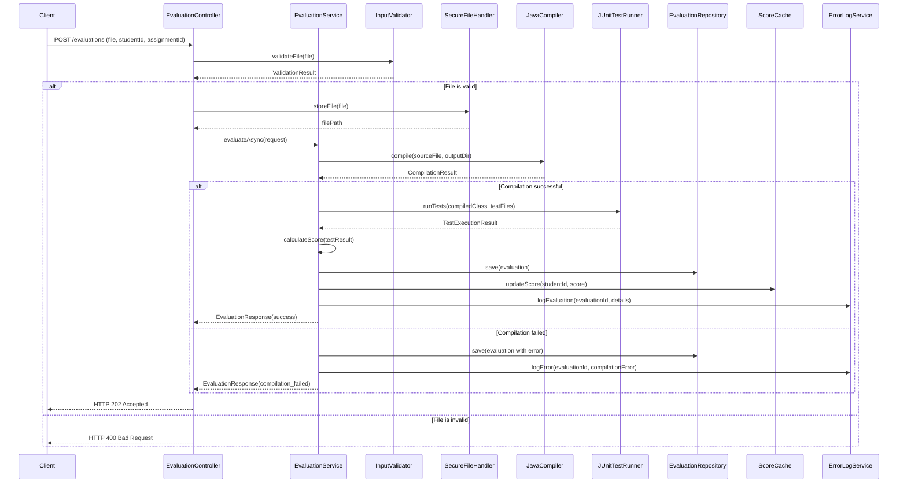

## 📁 Project Structure

```
src/main/java/com/studentevaluator/
├── 🚀 StudentEvaluatorApplication.java     # Main application entry point
├── 📡 controller/                          # REST API endpoints
├── 🔧 service/                            # Business logic layer
├── 🏗️ engine/                             # Core evaluation functionality
├── 💾 repository/                         # Data access layer
├── 📊 model/                              # Data structures
├── 🔄 dto/                                # Data transfer objects
├── ⚙️ config/                             # Configuration classes
├── 🔒 security/                           # Security components
├── 🖥️ cli/                                # Command-line interface
├── ⚠️ exception/                          # Custom error handling
└── 📈 monitoring/                         # System monitoring
```

## 🔍 Detailed Class Diagrams by Component

### Controller Layer Classes

```mermaid
classDiagram
    class EvaluationController {
        -EvaluationService evaluationService
        -InputValidator inputValidator
        -SecureFileHandler fileHandler
        
        +triggerEvaluation(EvaluationRequest request) ResponseEntity~EvaluationResponse~
        +getEvaluationStatus(String evaluationId) ResponseEntity~EvaluationResponse~
        +getEvaluationResults(String evaluationId) ResponseEntity~EvaluationResult~
        +uploadAssignment(MultipartFile file, AssignmentUploadRequest request) ResponseEntity~AssignmentResponse~
        +uploadTestFiles(String assignmentId, MultipartFile[] files) ResponseEntity~AssignmentResponse~
        +listAssignments(int page, int size) ResponseEntity~Page~AssignmentResponse~~
        
        -validateRequest(EvaluationRequest) ValidationResult
        -handleFileUpload(MultipartFile) String
        -buildEvaluationResponse(Evaluation) EvaluationResponse
    }
    
    class StudentController {
        -EvaluationService evaluationService
        -StudentRepository studentRepository
        -ScoreCache scoreCache
        
        +getStudentScores(String studentId) ResponseEntity~StudentScoreResponse~
        +getStudentEvaluations(String studentId, String assignmentId, String status) ResponseEntity~List~EvaluationResponse~~
        +getStudentProfile(String studentId) ResponseEntity~StudentResponse~
        
        -buildScoreResponse(String studentId) StudentScoreResponse
        -filterEvaluations(List~Evaluation~, String status) List~Evaluation~
    }
    
    class GlobalExceptionHandler {
        +handleValidationException(ValidationException) ResponseEntity~ErrorResponse~
        +handleCompilationException(CompilationException) ResponseEntity~ErrorResponse~
        +handleTestExecutionException(TestExecutionException) ResponseEntity~ErrorResponse~
        +handleStorageException(StorageException) ResponseEntity~ErrorResponse~
        +handleGenericException(Exception) ResponseEntity~ErrorResponse~
        
        -buildErrorResponse(String code, String message, Object details) ErrorResponse
        -logError(Exception exception, String context) void
    }
```

### Service Layer Classes

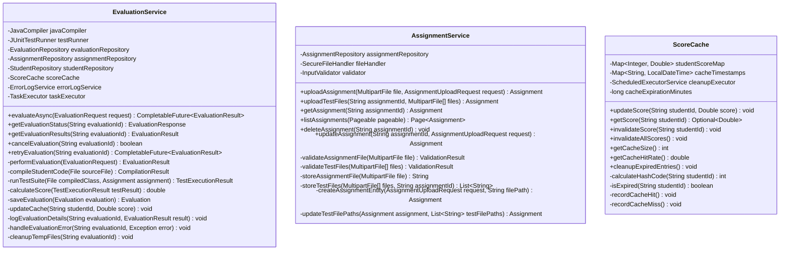

### Engine Layer Classes

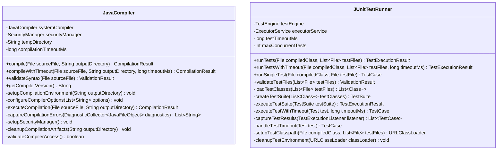

### Repository Layer Classes

```mermaid
classDiagram
    class StudentRepository {
        <<interface>>
        +findById(String studentId) Optional~Student~
        +findByEmail(String email) Optional~Student~
        +findByAssignmentId(String assignmentId) List~Student~
        +save(Student student) Student
        +deleteById(String studentId) void
        +existsById(String studentId) boolean
        +findAll(Pageable pageable) Page~Student~
        +countByCreatedAtBetween(LocalDateTime start, LocalDateTime end) long
    }
    
    class AssignmentRepository {
        <<interface>>
        +findById(String assignmentId) Optional~Assignment~
        +findByTitle(String title) List~Assignment~
        +findByCreatedAtBetween(LocalDateTime start, LocalDateTime end) List~Assignment~
        +save(Assignment assignment) Assignment
        +deleteById(String assignmentId) void
        +existsById(String assignmentId) boolean
        +findAll(Pageable pageable) Page~Assignment~
        +countAll() long
    }
    
    class EvaluationRepository {
        <<interface>>
        +findById(String evaluationId) Optional~Evaluation~
        +findByStudentId(String studentId) List~Evaluation~
        +findByAssignmentId(String assignmentId) List~Evaluation~
        +findByStudentIdAndAssignmentId(String studentId, String assignmentId) List~Evaluation~
        +findByStatus(EvaluationStatus status) List~Evaluation~
        +findByStudentIdAndStatus(String studentId, EvaluationStatus status) List~Evaluation~
        +save(Evaluation evaluation) Evaluation
        +deleteById(String evaluationId) void
        +findAverageScoreByAssignment(String assignmentId) Double
        +findTopScoresByAssignment(String assignmentId, int limit) List~Evaluation~
        +countByStatusAndCreatedAtBetween(EvaluationStatus status, LocalDateTime start, LocalDateTime end) long
    }
    
    class DynamoDBRepository {
        -DynamoDbClient dynamoDbClient
        -String tableName
        -String region
        
        +storeEvaluationLog(String evaluationId, EvaluationLog log) void
        +getEvaluationLogs(String evaluationId) List~EvaluationLog~
        +getEvaluationLogsByTimeRange(String evaluationId, LocalDateTime start, LocalDateTime end) List~EvaluationLog~
        +deleteEvaluationLogs(String evaluationId) void
        +queryLogsByLevel(String evaluationId, LogLevel level) List~EvaluationLog~
        
        -buildPutItemRequest(String evaluationId, EvaluationLog log) PutItemRequest
        -buildQueryRequest(String evaluationId) QueryRequest
        -convertToEvaluationLog(Map~String, AttributeValue~ item) EvaluationLog
        -handleDynamoDBException(Exception exception) void
    }
```

---

## 🚀 Application Entry Point

### [`StudentEvaluatorApplication.java`](../src/main/java/com/studentevaluator/StudentEvaluatorApplication.java)
**Purpose:** The main class that starts the entire application
**What it does:**
- Initializes the Spring Boot application
- Sets up all components and configurations
- Starts the web server on port 8080
- Enables auto-configuration for databases, security, and monitoring

**Key Functions:**
- `main()` - Entry point that launches the application
- Uses `@SpringBootApplication` annotation to enable Spring Boot features

---

## 📡 REST API Controllers (Web Interface)

### [`EvaluationController.java`](../src/main/java/com/studentevaluator/controller/EvaluationController.java)
**Purpose:** Handles all evaluation-related web requests
**What it does:**
- Receives file uploads from students and teachers
- Triggers evaluation processes
- Returns evaluation results and status
- Manages assignment submissions

**Key Endpoints:**
- `POST /api/v1/evaluations` - Submit student code for evaluation
- `GET /api/v1/evaluations/{id}` - Get evaluation status
- `GET /api/v1/evaluations/{id}/results` - Get detailed results

### [`StudentController.java`](../src/main/java/com/studentevaluator/controller/StudentController.java)
**Purpose:** Manages student-related operations
**What it does:**
- Retrieves student scores and performance data
- Provides student evaluation history
- Handles student-specific queries

**Key Endpoints:**
- `GET /api/v1/students/{id}/scores` - Get all scores for a student
- `GET /api/v1/students/{id}/evaluations` - Get evaluation history

### [`GlobalExceptionHandler.java`](../src/main/java/com/studentevaluator/controller/GlobalExceptionHandler.java)
**Purpose:** Centralized error handling for the entire application
**What it does:**
- Catches all errors that occur in the system
- Converts technical errors into user-friendly messages
- Ensures consistent error response format
- Logs errors for debugging

**Key Functions:**
- Handles compilation errors, file upload errors, database errors
- Returns structured JSON error responses
- Prevents system crashes from reaching users

---

## 🔧 Business Logic Services

### [`EvaluationService.java`](../src/main/java/com/studentevaluator/service/EvaluationService.java)
**Purpose:** Core business logic for evaluating student code
**What it does:**
- Orchestrates the entire evaluation process
- Manages async evaluation processing
- Calculates final scores
- Updates databases and cache

**Key Functions:**
- `evaluateAsync()` - Starts evaluation in background
- `calculateScore()` - Determines final grade based on test results
- `saveResults()` - Stores evaluation data

### [`AssignmentService.java`](../src/main/java/com/studentevaluator/service/AssignmentService.java)
**Purpose:** Manages assignment uploads and storage
**What it does:**
- Validates uploaded assignment files
- Stores assignment templates and test files
- Manages assignment metadata
- Handles file security and validation

**Key Functions:**
- `uploadAssignment()` - Processes new assignment uploads
- `uploadTestFiles()` - Associates test files with assignments
- `validateFile()` - Ensures files are safe and valid

### [`ScoreCache.java`](../src/main/java/com/studentevaluator/service/ScoreCache.java)
**Purpose:** Fast in-memory storage for frequently accessed scores
**What it does:**
- Stores student scores in memory for quick access
- Reduces database queries for better performance
- Automatically cleans up old entries
- Thread-safe for concurrent access

**Key Functions:**
- `updateScore()` - Stores new score in cache
- `getScore()` - Retrieves cached score
- `cleanupExpiredEntries()` - Removes old cache entries

### [`ErrorLogService.java`](../src/main/java/com/studentevaluator/service/ErrorLogService.java)
**Purpose:** Manages detailed error logging and tracking
**What it does:**
- Logs detailed error information to DynamoDB
- Tracks error patterns and frequencies
- Provides error analysis capabilities
- Helps with system debugging and monitoring

---

## 🏗️ Evaluation Engine (Core Functionality)

### [`JavaCompiler.java`](../src/main/java/com/studentevaluator/engine/JavaCompiler.java)
**Purpose:** Compiles Java source code safely
**What it does:**
- Takes student Java files and compiles them
- Runs compilation in a secure, isolated environment
- Captures compilation errors and warnings
- Produces bytecode files for testing

**Key Functions:**
- `compile()` - Compiles Java source to bytecode
- `validateSyntax()` - Checks for basic syntax errors
- `captureErrors()` - Collects compilation error messages

### [`JUnitTestRunner.java`](../src/main/java/com/studentevaluator/engine/JUnitTestRunner.java)
**Purpose:** Executes JUnit tests against student code
**What it does:**
- Runs teacher-provided tests against student code
- Captures test results (pass/fail)
- Measures test execution time
- Handles test timeouts and errors
- Provides detailed test feedback

**Key Functions:**
- `runTests()` - Executes all tests for an assignment
- `captureResults()` - Collects test outcomes
- `handleTimeout()` - Manages long-running tests

---

## 💾 Data Access Layer (Database Operations)

### [`StudentRepository.java`](../src/main/java/com/studentevaluator/repository/StudentRepository.java)
**Purpose:** Database operations for student data
**What it does:**
- Stores and retrieves student information
- Manages student records and metadata
- Provides queries for student lookup

### [`AssignmentRepository.java`](../src/main/java/com/studentevaluator/repository/AssignmentRepository.java)
**Purpose:** Database operations for assignment data
**What it does:**
- Stores assignment templates and metadata
- Manages assignment-test file relationships
- Provides assignment lookup and listing

### [`EvaluationRepository.java`](../src/main/java/com/studentevaluator/repository/EvaluationRepository.java)
**Purpose:** Database operations for evaluation results
**What it does:**
- Stores evaluation results and scores
- Manages evaluation history
- Provides queries for performance analysis
- Supports pagination for large result sets

### [`DynamoDBRepository.java`](../src/main/java/com/studentevaluator/repository/DynamoDBRepository.java)
**Purpose:** Handles unstructured data storage in DynamoDB
**What it does:**
- Stores detailed evaluation logs
- Manages large text data (compilation output, test logs)
- Provides fast access to evaluation details
- Handles schema-less data storage

### Security and Configuration Classes

```mermaid
classDiagram
    class InputValidator {
        -Set~String~ allowedExtensions
        -long maxFileSize
        -List~String~ maliciousPatterns
        
        +validateJavaFile(MultipartFile file) ValidationResult
        +validateTestFile(MultipartFile file) ValidationResult
        +validateFileName(String fileName) ValidationResult
        +validateFileSize(MultipartFile file) ValidationResult
        +validateFileContent(MultipartFile file) ValidationResult
        +scanForMaliciousContent(String content) ValidationResult
        
        -checkFileExtension(String fileName) boolean
        -checkFileSize(long fileSize) boolean
        -scanContentForPatterns(String content) List~String~
        -isJavaSourceFile(MultipartFile file) boolean
        -containsMaliciousCode(String content) boolean
    }
    
    class SecureFileHandler {
        -String baseDirectory
        -String tempDirectory
        -FileSystem fileSystem
        -SecurityManager securityManager
        
        +storeFile(MultipartFile file, String directory) String
        +storeTemporaryFile(MultipartFile file) String
        +readFile(String filePath) String
        +deleteFile(String filePath) boolean
        +moveFile(String sourcePath, String destinationPath) boolean
        +createSecureDirectory(String directoryPath) String
        
        -validateFilePath(String filePath) boolean
        -preventPathTraversal(String filePath) String
        -setSecurePermissions(File file) void
        -generateSecureFileName(String originalName) String
        -cleanupTempFiles(String directory) void
    }
    
    class RateLimitingFilter {
        -Map~String, RateLimitInfo~ rateLimitMap
        -int requestsPerMinute
        -long windowSizeMs
        
        +doFilter(ServletRequest request, ServletResponse response, FilterChain chain) void
        +isRateLimited(String clientId) boolean
        +resetRateLimit(String clientId) void
        +getCurrentRequestCount(String clientId) int
        
        -extractClientId(HttpServletRequest request) String
        -updateRequestCount(String clientId) void
        -isWithinRateLimit(String clientId) boolean
        -cleanupExpiredEntries() void
        -sendRateLimitResponse(HttpServletResponse response) void
    }
    
    class SecurityConfig {
        -String corsAllowedOrigins
        -boolean rateLimitEnabled
        
        +filterChain(HttpSecurity http) SecurityFilterChain
        +corsConfigurationSource() CorsConfigurationSource
        +passwordEncoder() PasswordEncoder
        +authenticationManager(AuthenticationConfiguration config) AuthenticationManager
        
        -configureHttpSecurity(HttpSecurity http) void
        -configureCors(CorsConfiguration configuration) void
        -configureSessionManagement(HttpSecurity http) void
    }
```

### CLI Classes

```mermaid
classDiagram
    class EvaluatorCLI {
        -CLIApiService apiService
        -CommandLineParser parser
        -Map~String, Command~ commands
        
        +main(String[] args) void
        +executeCommand(String[] args) int
        +registerCommand(String name, Command command) void
        +showHelp() void
        +showVersion() void
        
        -parseArguments(String[] args) CommandLine
        -validateArguments(CommandLine cmd) ValidationResult
        -handleCommandExecution(Command command, CommandLine cmd) int
        -handleError(Exception exception) int
    }
    
    class SubmitCommand {
        -CLIApiService apiService
        -InputValidator validator
        
        +execute(CommandLine cmd) int
        +getCommandName() String
        +getDescription() String
        +getOptions() Options
        
        -validateSubmissionArgs(CommandLine cmd) ValidationResult
        -uploadFile(File file, String studentId, String assignmentId) EvaluationResponse
        -waitForCompletion(String evaluationId, boolean waitFlag) EvaluationResult
        -displayResults(EvaluationResult result, String format) void
    }
    
    class ResultsCommand {
        -CLIApiService apiService
        -ResultFormatter formatter
        
        +execute(CommandLine cmd) int
        +getCommandName() String
        +getDescription() String
        +getOptions() Options
        
        -fetchResults(String evaluationId, boolean detailed) EvaluationResult
        -formatOutput(EvaluationResult result, String format) String
        -saveToFile(String content, String filePath) void
        -displayToConsole(String content) void
    }
    
    class CLIApiService {
        -String baseUrl
        -HttpClient httpClient
        -ObjectMapper objectMapper
        -String apiKey
        
        +submitEvaluation(File file, String studentId, String assignmentId) EvaluationResponse
        +getEvaluationStatus(String evaluationId) EvaluationResponse
        +getEvaluationResults(String evaluationId) EvaluationResult
        +uploadAssignment(File file, String title, String description) AssignmentResponse
        +uploadTestFiles(String assignmentId, File[] testFiles) AssignmentResponse
        +listAssignments(int page, int size) Page~AssignmentResponse~
        
        -buildRequest(String endpoint, HttpMethod method) HttpRequest.Builder
        -addAuthHeaders(HttpRequest.Builder builder) void
        -handleResponse(HttpResponse~String~ response, Class~T~ responseType) T
        -handleError(HttpResponse~String~ response) void
    }
```

### Exception Classes

```mermaid
classDiagram
    class EvaluationException {
        -String evaluationId
        -EvaluationStage stage
        
        +EvaluationException(String message)
        +EvaluationException(String message, Throwable cause)
        +EvaluationException(String evaluationId, String message)
        +EvaluationException(String evaluationId, EvaluationStage stage, String message)
        
        +getEvaluationId() String
        +getStage() EvaluationStage
        +getErrorCode() String
    }
    
    class CompilationException {
        -List~String~ compilationErrors
        -String sourceFile
        
        +CompilationException(String message, List~String~ errors)
        +CompilationException(String sourceFile, List~String~ errors)
        
        +getCompilationErrors() List~String~
        +getSourceFile() String
        +hasErrors() boolean
    }
    
    class TestExecutionException {
        -String testClass
        -String testMethod
        -TestFailureReason reason
        
        +TestExecutionException(String message)
        +TestExecutionException(String testClass, String message)
        +TestExecutionException(String testClass, String testMethod, String message)
        
        +getTestClass() String
        +getTestMethod() String
        +getFailureReason() TestFailureReason
    }
    
    class ValidationException {
        -String fieldName
        -Object rejectedValue
        -List~String~ validationErrors
        
        +ValidationException(String message)
        +ValidationException(String fieldName, String message)
        +ValidationException(String fieldName, Object rejectedValue, String message)
        
        +getFieldName() String
        +getRejectedValue() Object
        +getValidationErrors() List~String~
    }
    
    class StorageException {
        -String filePath
        -StorageOperation operation
        
        +StorageException(String message)
        +StorageException(String filePath, String message)
        +StorageException(String filePath, StorageOperation operation, String message)
        
        +getFilePath() String
        +getOperation() StorageOperation
    }
```

### Monitoring Classes

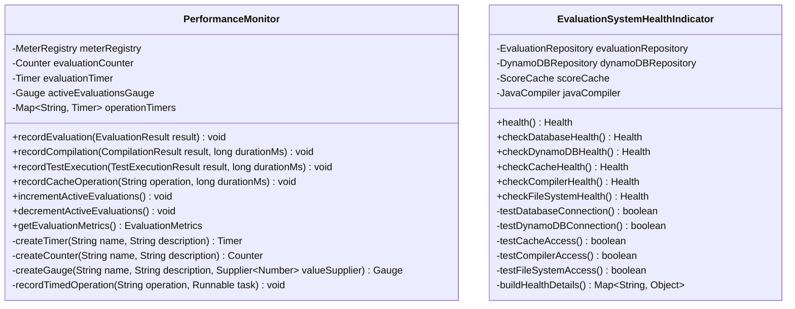

---

## 📊 Data Models (Data Structures)

### [`Student.java`](../src/main/java/com/studentevaluator/model/Student.java)
**Purpose:** Represents a student in the system
**Contains:**
- Student ID, name, email
- Relationship to evaluations
- Creation timestamp

### [`Assignment.java`](../src/main/java/com/studentevaluator/model/Assignment.java)
**Purpose:** Represents a programming assignment
**Contains:**
- Assignment ID, title, description
- Path to test files
- Creation timestamp
- Relationship to evaluations

### [`Evaluation.java`](../src/main/java/com/studentevaluator/model/Evaluation.java)
**Purpose:** Represents a single evaluation instance
**Contains:**
- Evaluation ID, student ID, assignment ID
- Score and maximum possible score
- Evaluation status (PENDING, COMPLETED, FAILED)
- Timestamp of evaluation

### [`CompilationResult.java`](../src/main/java/com/studentevaluator/model/CompilationResult.java)
**Purpose:** Contains results of Java compilation
**Contains:**
- Success/failure status
- Compilation output messages
- Error messages and line numbers
- Path to compiled class files

### [`TestExecutionResult.java`](../src/main/java/com/studentevaluator/model/TestExecutionResult.java)
**Purpose:** Contains results of test execution
**Contains:**
- Total, passed, and failed test counts
- Individual test case results
- Execution logs and timing information

### [`TestCase.java`](../src/main/java/com/studentevaluator/model/TestCase.java)
**Purpose:** Represents a single test case result
**Contains:**
- Test name and class
- Pass/fail status
- Execution time
- Error messages and stack traces

### [`EvaluationResult.java`](../src/main/java/com/studentevaluator/model/EvaluationResult.java)
**Purpose:** Complete evaluation outcome
**Contains:**
- Compilation and test results
- Final calculated score
- Overall evaluation status

---

## 🔄 Data Transfer Objects (API Communication)

### [`EvaluationRequest.java`](../src/main/java/com/studentevaluator/dto/EvaluationRequest.java)
**Purpose:** Data structure for evaluation requests
**Contains:** Student ID, assignment ID, file data

### [`EvaluationResponse.java`](../src/main/java/com/studentevaluator/dto/EvaluationResponse.java)
**Purpose:** Data structure for evaluation responses
**Contains:** Evaluation ID, status, score, timestamps

### [`AssignmentResponse.java`](../src/main/java/com/studentevaluator/dto/AssignmentResponse.java)
**Purpose:** Data structure for assignment information
**Contains:** Assignment details, test file paths, creation info

### [`StudentScoreResponse.java`](../src/main/java/com/studentevaluator/dto/StudentScoreResponse.java)
**Purpose:** Data structure for student performance data
**Contains:** Student info, scores, averages, evaluation history

### [`ErrorResponse.java`](../src/main/java/com/studentevaluator/dto/ErrorResponse.java)
**Purpose:** Standardized error message format
**Contains:** Error code, message, details, timestamp

---

## ⚙️ Configuration Classes

### [`AsyncConfig.java`](../src/main/java/com/studentevaluator/config/AsyncConfig.java)
**Purpose:** Configures asynchronous processing
**What it does:**
- Sets up thread pools for background tasks
- Configures evaluation processing threads
- Manages concurrent evaluation limits

### [`SecurityConfig.java`](../src/main/java/com/studentevaluator/config/SecurityConfig.java)
**Purpose:** Configures application security
**What it does:**
- Sets up authentication and authorization
- Configures CORS (Cross-Origin Resource Sharing)
- Manages security filters and rules

### [`DynamoDBConfig.java`](../src/main/java/com/studentevaluator/config/DynamoDBConfig.java)
**Purpose:** Configures DynamoDB connection
**What it does:**
- Sets up DynamoDB client
- Configures local vs. AWS DynamoDB
- Manages connection settings

### [`CacheConfig.java`](../src/main/java/com/studentevaluator/config/CacheConfig.java)
**Purpose:** Configures caching behavior
**What it does:**
- Sets up cache managers
- Configures cache expiration policies
- Manages cache storage settings

---

## 🔒 Security Components

### [`InputValidator.java`](../src/main/java/com/studentevaluator/security/InputValidator.java)
**Purpose:** Validates all input data for security
**What it does:**
- Checks file types and sizes
- Scans for malicious content
- Validates file names and paths
- Prevents code injection attacks

### [`SecureFileHandler.java`](../src/main/java/com/studentevaluator/security/SecureFileHandler.java)
**Purpose:** Handles file operations securely
**What it does:**
- Stores files in secure locations
- Prevents path traversal attacks
- Manages file permissions
- Cleans up temporary files

### [`RateLimitingFilter.java`](../src/main/java/com/studentevaluator/security/RateLimitingFilter.java)
**Purpose:** Prevents abuse by limiting request rates
**What it does:**
- Tracks requests per IP address
- Blocks excessive requests
- Prevents denial-of-service attacks
- Configurable rate limits

---

## 🖥️ Command Line Interface

### [`EvaluatorCLI.java`](../src/main/java/com/studentevaluator/cli/EvaluatorCLI.java)
**Purpose:** Main CLI application entry point
**What it does:**
- Parses command-line arguments
- Routes commands to appropriate handlers
- Provides help and usage information

### [`SubmitCommand.java`](../src/main/java/com/studentevaluator/cli/SubmitCommand.java)
**Purpose:** Handles student code submission via CLI
**What it does:**
- Uploads student files through command line
- Provides progress feedback
- Handles authentication and errors

### [`ResultsCommand.java`](../src/main/java/com/studentevaluator/cli/ResultsCommand.java)
**Purpose:** Retrieves and displays evaluation results
**What it does:**
- Fetches evaluation results
- Formats output (JSON, table, summary)
- Provides detailed or summary views

### [`UploadTestsCommand.java`](../src/main/java/com/studentevaluator/cli/UploadTestsCommand.java)
**Purpose:** Uploads test files via CLI
**What it does:**
- Handles test file uploads
- Validates test files
- Associates tests with assignments

### [`EvaluateCommand.java`](../src/main/java/com/studentevaluator/cli/EvaluateCommand.java)
**Purpose:** Triggers evaluation processes via CLI
**What it does:**
- Starts evaluation processes
- Monitors evaluation progress
- Provides status updates

### [`CLIApiService.java`](../src/main/java/com/studentevaluator/cli/CLIApiService.java)
**Purpose:** Handles API communication for CLI commands
**What it does:**
- Makes HTTP requests to the REST API
- Handles authentication and headers
- Manages request/response formatting
- Provides error handling for CLI operations

---

## ⚠️ Exception Handling

### [`EvaluationException.java`](../src/main/java/com/studentevaluator/exception/EvaluationException.java)
**Purpose:** Handles evaluation-specific errors
**Used for:** Evaluation process failures, scoring errors

### [`CompilationException.java`](../src/main/java/com/studentevaluator/exception/CompilationException.java)
**Purpose:** Handles Java compilation errors
**Used for:** Syntax errors, missing dependencies, compilation failures

### [`TestExecutionException.java`](../src/main/java/com/studentevaluator/exception/TestExecutionException.java)
**Purpose:** Handles test execution problems
**Used for:** Test timeouts, test framework errors, runtime exceptions

### [`ValidationException.java`](../src/main/java/com/studentevaluator/exception/ValidationException.java)
**Purpose:** Handles input validation errors
**Used for:** Invalid files, malformed requests, security violations

### [`StorageException.java`](../src/main/java/com/studentevaluator/exception/StorageException.java)
**Purpose:** Handles file and database storage errors
**Used for:** File system errors, database connection issues, storage failures

---

## 📈 Monitoring and Performance

### [`PerformanceMonitor.java`](../src/main/java/com/studentevaluator/monitoring/PerformanceMonitor.java)
**Purpose:** Tracks system performance metrics
**What it does:**
- Measures evaluation processing times
- Tracks request rates and response times
- Monitors resource usage
- Provides performance statistics

### [`EvaluationSystemHealthIndicator.java`](../src/main/java/com/studentevaluator/monitoring/EvaluationSystemHealthIndicator.java)
**Purpose:** Monitors overall system health
**What it does:**
- Checks database connectivity
- Monitors file system access
- Verifies external service availability
- Provides health status for monitoring tools

## 🔄 Complete Method Interaction Diagrams

### Assignment Upload Flow

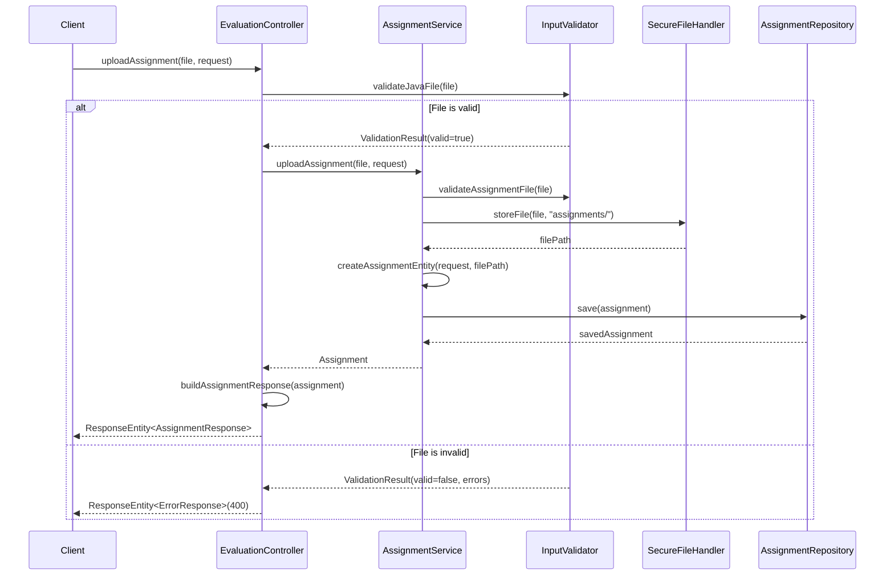

### Test File Upload Flow

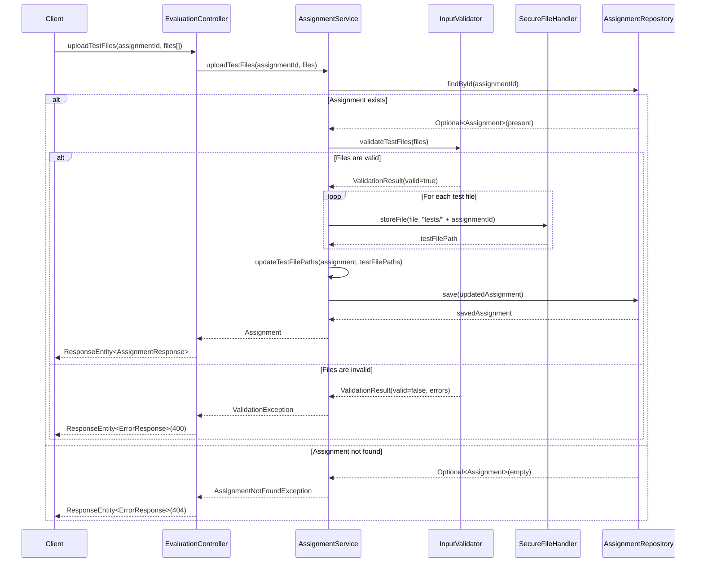

### Complete Evaluation Flow

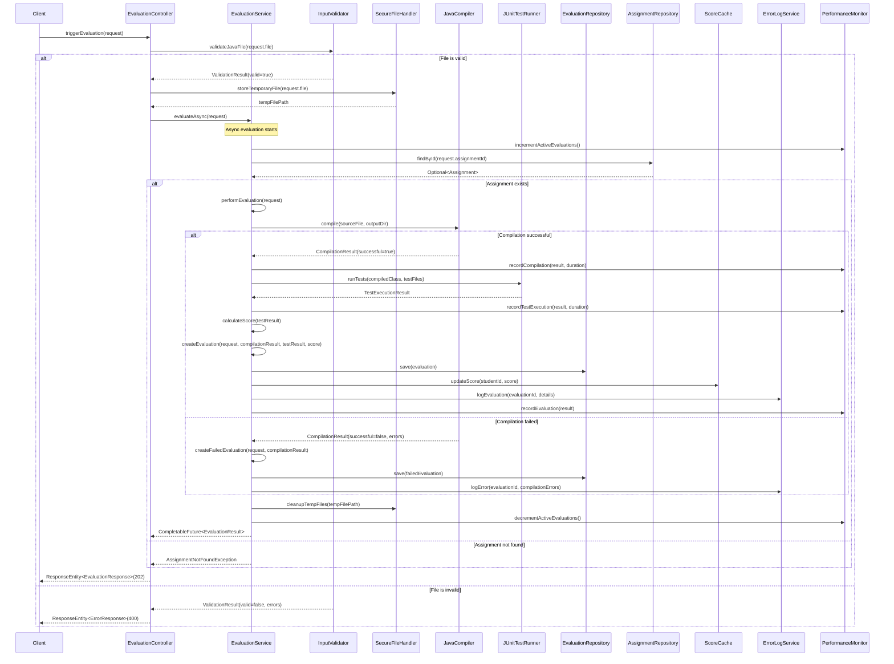

### Score Retrieval Flow

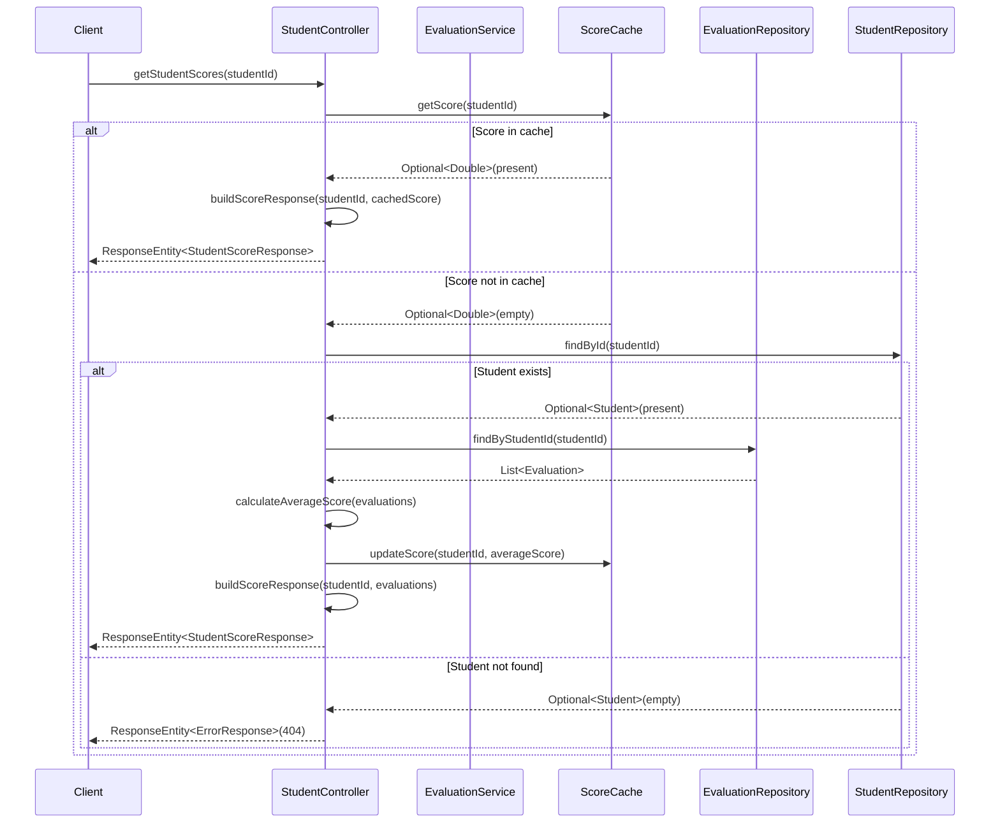

### CLI Command Execution Flow

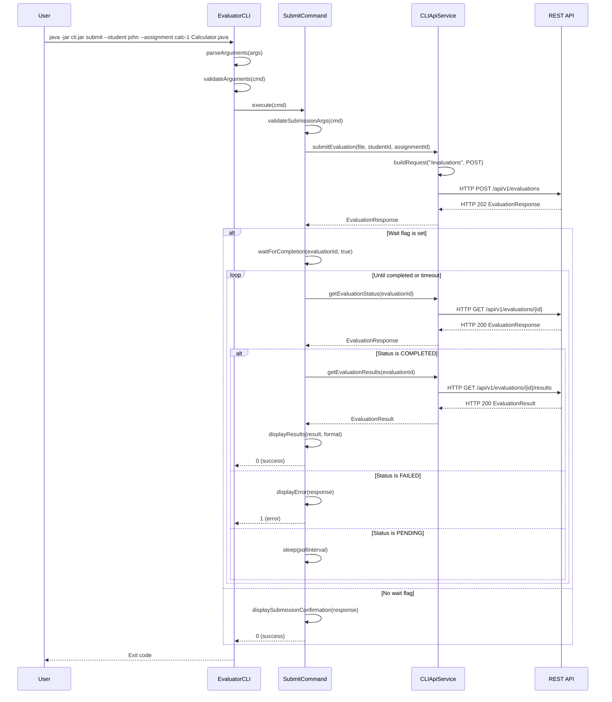

---

## 🔗 How Components Work Together

### Typical Evaluation Flow:

1. **Request Handling:** `EvaluationController` receives student submission
2. **Validation:** `InputValidator` checks file safety and format
3. **File Storage:** `SecureFileHandler` stores files securely
4. **Business Logic:** `EvaluationService` orchestrates the evaluation
5. **Compilation:** `JavaCompiler` compiles the student code
6. **Testing:** `JUnitTestRunner` executes tests against compiled code
7. **Scoring:** `EvaluationService` calculates final scores
8. **Storage:** `EvaluationRepository` saves results to database
9. **Caching:** `ScoreCache` stores scores for quick access
10. **Logging:** `ErrorLogService` records detailed evaluation logs
11. **Response:** `EvaluationController` returns results to user

### Data Flow:
```
User Request → Controller → Service → Engine → Repository → Database
     ↑                                                          ↓
Response ← DTO ← Model ← Results ← Processing ← Storage ← Cache
```

---

## 🧪 Test Files Organization

### Unit Tests
- **Location:** `src/test/java/com/studentevaluator/`
- **Purpose:** Test individual components in isolation
- **Examples:** `EvaluationServiceTest.java`, `JavaCompilerTest.java`

### Integration Tests
- **Purpose:** Test component interactions
- **Examples:** `EvaluationServiceIntegrationTest.java`, `RepositoryCompilationTest.java`

### BDD Tests
- **Location:** `src/test/java/com/studentevaluator/bdd/`
- **Purpose:** Test complete user scenarios
- **Features:** `src/test/resources/features/`

### Performance Tests
- **Location:** `src/test/java/com/studentevaluator/performance/`
- **Purpose:** Test system performance under load
- **Examples:** `LoadTest.java`, `PerformanceTest.java`

---

## 📝 Configuration Files

### [`application.yml`](../src/main/resources/application.yml)
**Purpose:** Main application configuration
**Contains:** Database settings, server configuration, logging levels

### [`pom.xml`](../pom.xml)
**Purpose:** Maven project configuration
**Contains:** Dependencies, build settings, plugin configurations

---

## 🚀 Getting Started with the Code

### For Developers:
1. **Start with:** `StudentEvaluatorApplication.java` - understand the entry point
2. **Explore Controllers:** See how API requests are handled
3. **Understand Services:** Learn the business logic
4. **Study the Engine:** See how evaluation actually works
5. **Check Models:** Understand the data structures
6. **Review Tests:** See examples of how components work

### For Contributors:
1. **Read the Architecture Guide:** [`docs/developer/ARCHITECTURE_GUIDE.md`](developer/ARCHITECTURE_GUIDE.md)
2. **Check Coding Standards:** Follow existing patterns
3. **Write Tests:** Add tests for new functionality
4. **Update Documentation:** Keep this guide current

### For Customization:
1. **Configuration:** Modify `application.yml` for your environment
2. **Security:** Adjust `SecurityConfig.java` for your needs
3. **Evaluation Logic:** Extend `EvaluationService.java` for custom scoring
4. **API Endpoints:** Add new controllers for additional functionality

---

## 📚 Additional Resources

- **API Documentation:** [`docs/api/openapi.yaml`](api/openapi.yaml)
- **User Guides:** [`docs/user-guides/`](user-guides/)
- **Deployment Guides:** [`docs/deployment/`](deployment/)
- **Troubleshooting:** [`docs/troubleshooting/TROUBLESHOOTING_GUIDE.md`](troubleshooting/TROUBLESHOOTING_GUIDE.md)
- **FAQ:** [`docs/FAQ.md`](FAQ.md)

---

*This code reference guide is maintained alongside the codebase. When adding new components or modifying existing ones, please update this documentation to help other developers understand the system.*