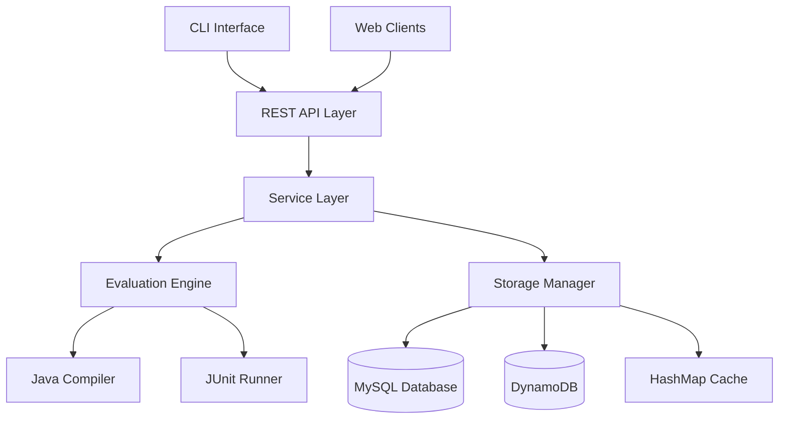

# E-Learning Platform with Auto Evaluation - Design Document

## Overview

The Student Evaluator System is designed as a microservices-based application that automates the evaluation of Java programming assignments. The system follows a layered architecture with clear separation between API layer, business logic, and data persistence. It integrates multiple technologies including Spring Boot for the REST API, JUnit for test execution, MySQL for structured data, DynamoDB for unstructured logs, and provides both REST API and CLI interfaces.

## Architecture

### High-Level Architecture



### Component Architecture

The system is organized into the following main components:

1. **API Layer**: RESTful endpoints using Spring Boot
2. **Service Layer**: Business logic and orchestration
3. **Evaluation Engine**: Core compilation and testing functionality
4. **Storage Manager**: Data persistence across multiple storage systems
5. **CLI Interface**: Command-line interface for direct system interaction

## Components and Interfaces

### 1. REST API Layer

**Technology**: Spring Boot with Spring Web

**Responsibilities**:
- Handle HTTP requests and responses
- Input validation and sanitization
- Authentication and authorization (future enhancement)
- Error handling and response formatting

**Key Endpoints**:
```java
@RestController
@RequestMapping("/api/v1")
public class EvaluationController {
    // Assignment management
    POST /assignments - Upload assignment file
    POST /assignments/{id}/tests - Upload test files
    GET /assignments - List assignments
    
    // Evaluation operations
    POST /evaluations - Trigger evaluation
    GET /evaluations/{id} - Get evaluation status
    GET /evaluations/{id}/results - Get detailed results
    
    // Student and results
    GET /students/{id}/scores - Get student scores
    GET /students/{id}/evaluations - Get student evaluation history
}
```

### 2. Service Layer

**Core Services**:

```java
@Service
public class AssignmentService {
    // Assignment file management
    // Test case association
    // Assignment metadata handling
}

@Service
public class EvaluationService {
    // Orchestrate evaluation process
    // Coordinate between compilation and testing
    // Result aggregation and storage
}

@Service
public class StudentService {
    // Student data management
    // Score tracking and retrieval
    // HashMap-based quick lookups
}
```

### 3. Evaluation Engine

**Core Components**:

```java
@Component
public class JavaCompiler {
    public CompilationResult compile(File javaFile, String outputDir);
    public boolean isCompilationSuccessful(CompilationResult result);
}

@Component
public class JUnitTestRunner {
    public TestExecutionResult runTests(File compiledClass, List<File> testFiles);
    public TestSummary generateSummary(TestExecutionResult result);
}

@Component
public class EvaluationEngine {
    public EvaluationResult evaluate(Assignment assignment, File submission);
}
```

**Evaluation Process Flow**:
1. Receive assignment submission
2. Validate file format and content
3. Compile Java source code
4. If compilation successful, run JUnit tests
5. Collect results and generate evaluation report
6. Store results in appropriate databases
7. Update in-memory cache

### 4. Storage Manager

**Database Schemas**:

**MySQL Schema**:
```sql
-- Students table
CREATE TABLE students (
    student_id VARCHAR(50) PRIMARY KEY,
    name VARCHAR(100) NOT NULL,
    email VARCHAR(100),
    created_at TIMESTAMP DEFAULT CURRENT_TIMESTAMP
);

-- Assignments table
CREATE TABLE assignments (
    assignment_id VARCHAR(50) PRIMARY KEY,
    title VARCHAR(200) NOT NULL,
    description TEXT,
    created_at TIMESTAMP DEFAULT CURRENT_TIMESTAMP,
    test_file_path VARCHAR(500)
);

-- Evaluations table
CREATE TABLE evaluations (
    evaluation_id VARCHAR(50) PRIMARY KEY,
    student_id VARCHAR(50),
    assignment_id VARCHAR(50),
    score DECIMAL(5,2),
    max_score DECIMAL(5,2),
    status ENUM('PENDING', 'COMPLETED', 'FAILED'),
    evaluated_at TIMESTAMP DEFAULT CURRENT_TIMESTAMP,
    FOREIGN KEY (student_id) REFERENCES students(student_id),
    FOREIGN KEY (assignment_id) REFERENCES assignments(assignment_id)
);
```

**DynamoDB Schema**:
```json
{
  "TableName": "evaluation_logs",
  "KeySchema": [
    {
      "AttributeName": "evaluation_id",
      "KeyType": "HASH"
    },
    {
      "AttributeName": "timestamp",
      "KeyType": "RANGE"
    }
  ],
  "AttributeDefinitions": [
    {
      "AttributeName": "evaluation_id",
      "AttributeType": "S"
    },
    {
      "AttributeName": "timestamp",
      "AttributeType": "S"
    }
  ]
}
```

**Storage Components**:
```java
@Repository
public class MySQLRepository {
    // CRUD operations for structured data
    // Student, Assignment, Evaluation entities
}

@Repository
public class DynamoDBRepository {
    // Log storage and retrieval
    // Unstructured data management
}

@Component
public class ScoreCache {
    private Map<Integer, Double> studentScoreMap = new ConcurrentHashMap<>();
    // HashMap implementation for quick score lookups
}
```

### 5. CLI Interface

**Implementation**: Picocli framework for command-line interface

```java
@Command(name = "evaluator", description = "Student Evaluator System CLI")
public class EvaluatorCLI {
    
    @Command(name = "submit")
    public void submitAssignment(@Parameters String assignmentFile, 
                               @Option("--student") String studentId);
    
    @Command(name = "upload-tests")
    public void uploadTests(@Parameters String testFile, 
                          @Option("--assignment") String assignmentId);
    
    @Command(name = "evaluate")
    public void triggerEvaluation(@Option("--assignment") String assignmentId,
                                @Option("--student") String studentId);
    
    @Command(name = "results")
    public void getResults(@Option("--student") String studentId,
                         @Option("--assignment") String assignmentId);
}
```

## Data Models

### Core Entity Models

```java
@Entity
@Table(name = "students")
public class Student {
    @Id
    private String studentId;
    private String name;
    private String email;
    private LocalDateTime createdAt;
    
    // Constructors, getters, setters
}

@Entity
@Table(name = "assignments")
public class Assignment {
    @Id
    private String assignmentId;
    private String title;
    private String description;
    private String testFilePath;
    private LocalDateTime createdAt;
    
    // Constructors, getters, setters
}

@Entity
@Table(name = "evaluations")
public class Evaluation {
    @Id
    private String evaluationId;
    private String studentId;
    private String assignmentId;
    private BigDecimal score;
    private BigDecimal maxScore;
    private EvaluationStatus status;
    private LocalDateTime evaluatedAt;
    
    // Constructors, getters, setters
}
```

### Result Models

```java
public class CompilationResult {
    private boolean successful;
    private String output;
    private List<String> errors;
    private String compiledClassPath;
}

public class TestExecutionResult {
    private int totalTests;
    private int passedTests;
    private int failedTests;
    private List<TestCase> testCases;
    private String executionLog;
}

public class EvaluationResult {
    private String evaluationId;
    private CompilationResult compilationResult;
    private TestExecutionResult testResult;
    private double finalScore;
    private EvaluationStatus status;
}
```

## Error Handling

### Exception Hierarchy

```java
public class EvaluationException extends RuntimeException {
    // Base exception for evaluation-related errors
}

public class CompilationException extends EvaluationException {
    // Compilation-specific errors
}

public class TestExecutionException extends EvaluationException {
    // Test execution errors
}

public class StorageException extends EvaluationException {
    // Database and storage errors
}
```

### Error Response Format

```json
{
  "error": {
    "code": "COMPILATION_FAILED",
    "message": "Java compilation failed",
    "details": {
      "file": "StudentSubmission.java",
      "line": 15,
      "errors": ["cannot find symbol: variable x"]
    },
    "timestamp": "2024-01-15T10:30:00Z"
  }
}
```

## Testing Strategy

### Unit Testing
- **Framework**: JUnit 5 with Mockito
- **Coverage**: All service layer components
- **Mock Strategy**: Mock external dependencies (databases, file system)

### Integration Testing
- **Database Testing**: Testcontainers for MySQL and DynamoDB Local
- **API Testing**: Spring Boot Test with TestRestTemplate
- **End-to-End Testing**: Complete evaluation workflow testing

### Test Categories

```java
@ExtendWith(MockitoExtension.class)
class EvaluationServiceTest {
    // Unit tests for evaluation logic
}

@SpringBootTest
@Testcontainers
class EvaluationIntegrationTest {
    // Integration tests with real databases
}

@SpringBootTest(webEnvironment = SpringBootTest.WebEnvironment.RANDOM_PORT)
class EvaluationControllerTest {
    // API endpoint testing
}
```

### BDD Testing
- **Framework**: Cucumber with Spring Boot
- **Scenarios**: Assignment submission, evaluation process, result retrieval
- **Feature Files**: Gherkin syntax for behavior specification

## Security Considerations

### Input Validation
- File type validation (only .java files accepted)
- File size limits (prevent large file uploads)
- Content sanitization (prevent code injection)
- Path traversal protection

### Code Execution Safety
- Sandboxed compilation environment
- Resource limits for test execution
- Timeout mechanisms for long-running tests
- Restricted file system access

### Data Protection
- Input sanitization for SQL injection prevention
- Parameterized queries for database operations
- Secure file storage with proper permissions

## Performance Optimization

### Caching Strategy
- In-memory HashMap for frequent score lookups
- Redis cache for evaluation results (future enhancement)
- Database connection pooling

### Asynchronous Processing
- Async evaluation processing for large assignments
- Queue-based system for handling multiple submissions
- Progress tracking for long-running evaluations

### Resource Management
- Connection pooling for databases
- File cleanup after evaluation
- Memory management for compilation processes

## Deployment Architecture

### Local Development
- Embedded databases for development
- Docker Compose for service orchestration
- Hot reload for development efficiency

### Production Deployment
- Containerized services with Docker
- MySQL and DynamoDB as managed services
- Load balancing for API endpoints
- Monitoring and logging integration

## Configuration Management

### Application Properties
```yaml
# application.yml
spring:
  datasource:
    url: jdbc:mysql://localhost:3306/student_evaluator
    username: ${DB_USERNAME:evaluator}
    password: ${DB_PASSWORD:password}
  
  jpa:
    hibernate:
      ddl-auto: validate
    show-sql: false

aws:
  dynamodb:
    endpoint: ${DYNAMODB_ENDPOINT:http://localhost:8000}
    region: ${AWS_REGION:us-east-1}

evaluation:
  timeout: 30000  # 30 seconds
  max-file-size: 1MB
  temp-directory: ${TEMP_DIR:/tmp/evaluations}
```

This design provides a robust, scalable foundation for the Student Evaluator System while maintaining clear separation of concerns and supporting the specified requirements for automated Java assignment evaluation.